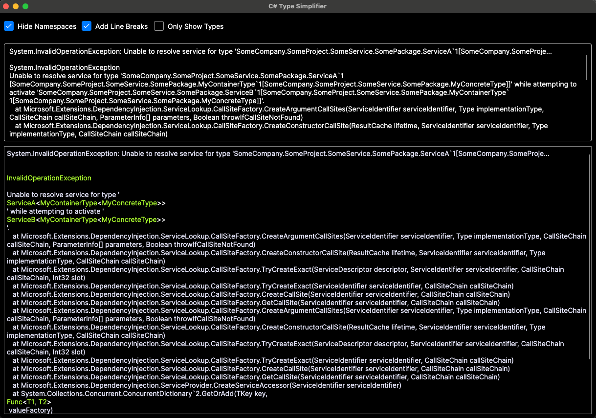

# C# Error Message Type Simplifier

A small utility app which helps you spot and simplify types in C# error messages.

Ever struggled to read a C# error like this?

```
System.InvalidOperationException: Unable to resolve service for type 'SomeCompany.SomeProject.SomeService.SomePackage.ServiceA`1[SomeCompany.SomeProje...

System.InvalidOperationException
Unable to resolve service for type 'SomeCompany.SomeProject.SomeService.SomePackage.ServiceA`1[SomeCompany.SomeProject.SomeService.SomePackage.MyContainerType`1[SomeCompany.SomeProject.SomeService.SomePackage.MyConcreteType]]' while attempting to activate 'SomeCompany.SomeProject.SomeService.SomePackage.ServiceB`1[SomeCompany.SomeProject.SomeService.SomePackage.MyContainerType`1[SomeCompany.SomeProject.SomeService.SomePackage.MyConcreteType]]'.
   at Microsoft.Extensions.DependencyInjection.ServiceLookup.CallSiteFactory.CreateArgumentCallSites(ServiceIdentifier serviceIdentifier, Type implementationType, CallSiteChain callSiteChain, ParameterInfo[] parameters, Boolean throwIfCallSiteNotFound)
   at Microsoft.Extensions.DependencyInjection.ServiceLookup.CallSiteFactory.CreateConstructorCallSite(ResultCache lifetime, ServiceIdentifier serviceIdentifier, Type implementationType, CallSiteChain callSiteChain)
   at Microsoft.Extensions.DependencyInjection.ServiceLookup.CallSiteFactory.TryCreateExact(ServiceDescriptor descriptor, ServiceIdentifier serviceIdentifier, CallSiteChain callSiteChain, Int32 slot)
   at Microsoft.Extensions.DependencyInjection.ServiceLookup.CallSiteFactory.TryCreateExact(ServiceIdentifier serviceIdentifier, CallSiteChain callSiteChain)
   at Microsoft.Extensions.DependencyInjection.ServiceLookup.CallSiteFactory.CreateCallSite(ServiceIdentifier serviceIdentifier, CallSiteChain callSiteChain)
   at Microsoft.Extensions.DependencyInjection.ServiceLookup.CallSiteFactory.GetCallSite(ServiceIdentifier serviceIdentifier, CallSiteChain callSiteChain)
   at Microsoft.Extensions.DependencyInjection.ServiceLookup.CallSiteFactory.CreateArgumentCallSites(ServiceIdentifier serviceIdentifier, Type implementationType, CallSiteChain callSiteChain, ParameterInfo[] parameters, Boolean throwIfCallSiteNotFound)
   at Microsoft.Extensions.DependencyInjection.ServiceLookup.CallSiteFactory.CreateConstructorCallSite(ResultCache lifetime, ServiceIdentifier serviceIdentifier, Type implementationType, CallSiteChain callSiteChain)
   at Microsoft.Extensions.DependencyInjection.ServiceLookup.CallSiteFactory.TryCreateExact(ServiceDescriptor descriptor, ServiceIdentifier serviceIdentifier, CallSiteChain callSiteChain, Int32 slot)
   at Microsoft.Extensions.DependencyInjection.ServiceLookup.CallSiteFactory.TryCreateExact(ServiceIdentifier serviceIdentifier, CallSiteChain callSiteChain)
   at Microsoft.Extensions.DependencyInjection.ServiceLookup.CallSiteFactory.CreateCallSite(ServiceIdentifier serviceIdentifier, CallSiteChain callSiteChain)
   at Microsoft.Extensions.DependencyInjection.ServiceLookup.CallSiteFactory.GetCallSite(ServiceIdentifier serviceIdentifier, CallSiteChain callSiteChain)
   at Microsoft.Extensions.DependencyInjection.ServiceProvider.CreateServiceAccessor(ServiceIdentifier serviceIdentifier)
   at System.Collections.Concurrent.ConcurrentDictionary`2.GetOrAdd(TKey key, Func`2 valueFactory)
   at Microsoft.Extensions.DependencyInjection.ServiceProvider.GetService(ServiceIdentifier serviceIdentifier, ServiceProviderEngineScope serviceProviderEngineScope)
   at Microsoft.Extensions.DependencyInjection.ServiceProvider.GetService(Type serviceType)
   at Microsoft.Extensions.DependencyInjection.ServiceProviderServiceExtensions.GetService[T](IServiceProvider provider)
   at TestProject1.UnitTest1.Test1() in /Users/tomoram/Projects/tomoram/fsharp-parser/TestProject1/UnitTest1.cs:line 24
   at System.RuntimeMethodHandle.InvokeMethod(Object target, Void** arguments, Signature sig, Boolean isConstructor)
   at System.Reflection.MethodBaseInvoker.InvokeWithNoArgs(Object obj, BindingFlags invokeAttr)
```

Paste it into the app and quickly spot and simplify the types:


